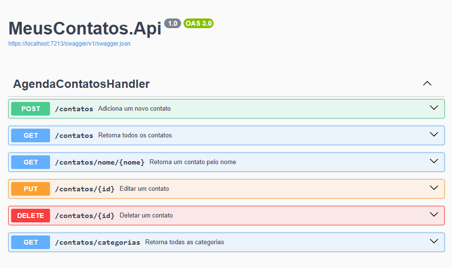

# Minimal API para Gestão de Agenda de Contatos em C#

  

## 💻 Projeto

Esta API simples foi construída para gerenciar contatos em uma agenda. Ela oferece funcionalidades básicas para adicionar, atualizar, listar, excluir e buscar contatos por nome, permitindo a manipulação eficiente dos dados de forma minimalista e direta.

## Funcionalidades principais:

- **Adicionar Contato**: Permite incluir novos contatos na agenda.
- **Atualizar Contato**: Possibilita a atualização dos dados de um contato existente.
- **Listar Contatos**: Exibe todos os contatos armazenados na agenda.
- **Excluir Contato**: Remove contatos da agenda.
- **Buscar Contato por Nome**: Permite buscar contatos pelo nome, facilitando a localização de um contato específico.

## Tecnologias

- **C#**
- **Minimal API** (ASP.NET Core)

A API foi desenvolvida utilizando o C# com o padrão Minimal API, proporcionando uma estrutura leve e de fácil manutenção.
